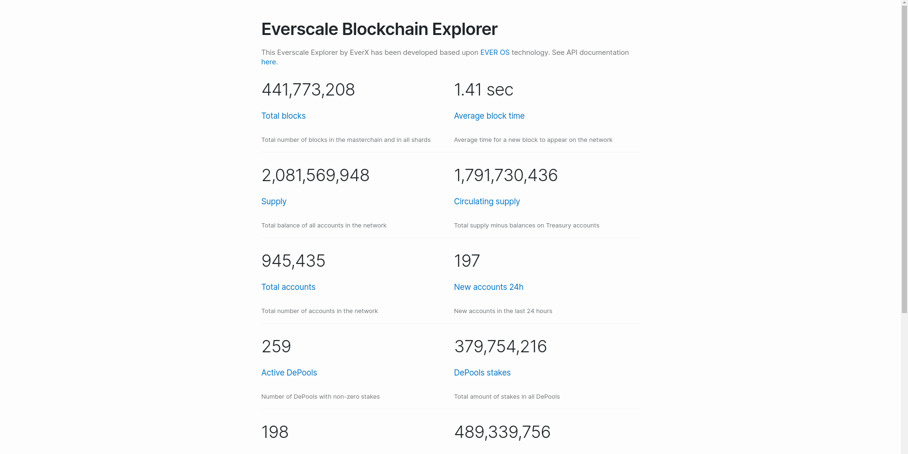
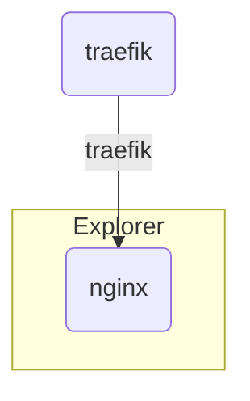

# Explorer



Copy of [evernode-se](https://github.com/tonlabs/evernode-se) frontend.
Lots of crappy code, but this is a temporary solution to view blockchain data.

## Up local

[Up application server](https://github.com/treeton-org/application-server#readme)

```shell
docker network create traefik
docker compose --env-file .env.local up
```

## Deploy on server

### Set secrets

* `SSH_DEPLOY_PRIVATE_KEY` - e.g. `AAAwEAA ...`

### Push code and check GitHub actions

[GitHub action](https://github.com/treeton-org/explorer/actions/workflows/deploy.yaml)

## Docker network scheme



## Hardcode

GraphQL URL hardcoded in main.bundle.js. See:

```shell
https://gql.treeton.org
```